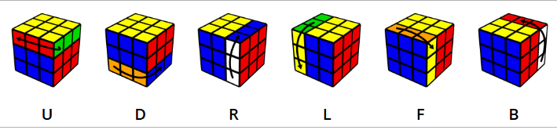
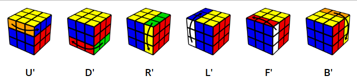

# Cubo de rubik con TWEENJS

## Descripción

Este proyecto es un cubo de rubik 3x3x3 que se puede manipular con botones de la interfaz gráfica. Para la animación de los movimientos se ha utilizado la librería TWEENJS de JavaScript.

## Movimientos posibles

